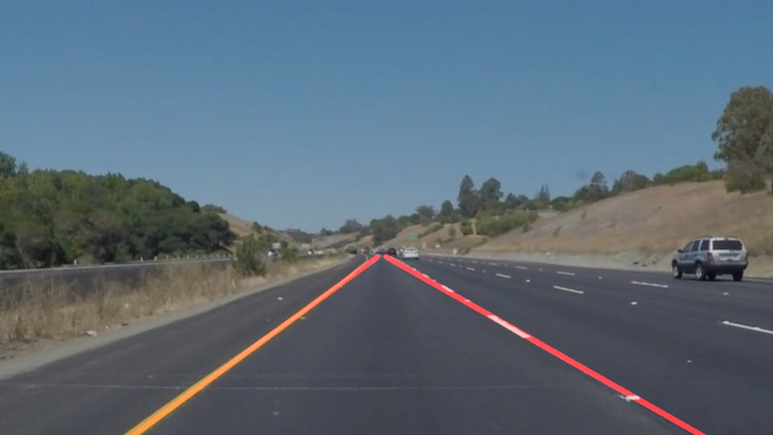

# **Finding Lane Lines on the Road** 

## Project 1 (Self-Driving Car Engineer - Udacity)

When we drive, we use our eyes to decide where to go. The lines on the road that show us where the lanes are act as our constant reference for where to steer the vehicle.  Naturally, one of the first things we would like to do in developing a self-driving car is to automatically detect lane lines using an algorithm. The goals of this project is to make a pipeline that finds lane lines on the road.

### Reflection

### 1. Pipeline 

To detect the lane markings, this pipeline consist of six basic steps:
* Converting the image to grayscale.
* Applying gaussian blur to the previous image. Parameters (kernel_size).
* Applying canny algorithm to extract the edges Parameters (low and high threshold).
* Generating and applying a mask of the road (area of interest) based on the image size. Parameters (Vertices coordinates).
* Obtaining lines from the hough transform. Parameters (resolution of rho and theta, threshold, minimum line length, max line gap).
* Draw the lines on the edge image. This method calculates a weighted average of the lines identified as right and left lane to obtain a single like which is extrapolated over the area of interest.

### 2. Shortcomings 

The parameters in this pipeline were fine-tuned to adjust the algorithms to the lighting conditions and the camera position. Strong shadows, dissimilar illumination or camera pose will require the adjustment of those parameters. 

### 3. Improvements 

Potential improvements can be made in defining the area of interest, at the moment it's represented as a trapeze, but more complex geometries can be defined. Another potential improvement could be in extracting the parameters which define each lane, e.g. using the parameters of the longest detected line. Applying image processing techniques in different areas would also improve lane detection e.g. lines are more blurred when they are "seen" far away.  

